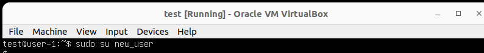

# Report Linux DO1
## Part 1. Установка ОС
1. Чтобы узнать версию ОС, необходимо выполнить команду:

`cat /etc/issue`

## Part 2. Создание пользователя
1. Для создания нового пользователя небходимо выполнить команду:

`sudo useradd -G adm new_user`

2. Проверяем нового созданного пользователя:

`cat /etc/passwd | grep new_user`

3. Проверяем к каким группам относится новый пользователь:

`groups new_user`

## Part 3. Настройка сети ОС

1. Задаем и проверяем новое имя машины:

`sudo hostnamectl set-hostname user-1`

2. Задаем новую временную зону и проверяем изменения:

`sudo timedatectl set-timezone Europe/Moscow`

`timedatectl`

3. Узнаем названия интерфейсов и ip рабочей машины:

`ip a`

`hostname -I`

`lo (loopback device) – виртуальный интерфейс, присутствующий по умолчанию в любом Linux. Он используется для отладки сетевых программ и запуска серверных приложений на локальной машине. С этим интерфейсом всегда связан адрес 127.0.0.1. У него есть dns-имя – localhost.`

`DHCP — сетевой протокол, позволяющий сетевым устройствам автоматически получать IP-адрес и другие параметры, необходимые для работы в сети TCP/IP.`

4. Узнать внутренний ip адрес и внешний ip адрес шлюза можно при помощи команд:

`ip route`

5. Для того чтобы задать статичные ip, gw, dns необходимо изменить netplan:

`sudo vim /etc/netplan/00-installer-config.yaml`

6. Вносим следующие изменения и выполняем команду:

`sudo netplan apply`

7. Перезагружаем виртуальную машину командой:

`sudo reboot`

8. Проверяем внесенные изменения:

9. Пингуем 1.1.1.1 командой:

`ping 1.1.1.1`

10. Пингуем ya.ru командой:

`ping ya.ru`

## Part 4. Обновление ОС
1. Обновляем системные пакеты:

`sudo apt-get update`

`sudo apt-get upgrade`

## Part 5. Использование команды sudo
`Главное назначение sudo — это выполнить команду от имени другого пользователя, обычно от root.`

1. Проверяем права sudo для созданного ранее пользователя:

`sudo -l -U new_user`

2. Выдаем права sudo для пользователя:

`sudo usermod -aG sudo new_user`

3. Для того, чтобы изменить hostname ОС от имени пользователя необходимо выполнить следующие команды:

`sudo su - new_user`

`sudo hostname changed`

4. Проверяем измененный hostname:

`hostname`

## Part 6. Установка и настройка службы времени
1. Настраиваем автоматическую синхронизацию времени:

`sudo timedatectl`

`timedatectl show`

## Part 7. Установка и использование текстовых редакторов
1. Создаем текстовый файл при помощи VIM:

`vim test_VIM.txt`

`Режим редактирования - i`

`Выйти из режима редактирования - esc`

2. Добавляем никнейм и выходим с сохранением:

`:wq`

3. Создаем текстовый файл при помощи NANO:

`nano test_NANO.txt`

4. Добавляем никнейм и выходим с сохранением:

`Сохранение - ctrl + o`

`Выход - ctrl + x (N без сохранения, Y с сохранением)`

5. Создаем текстовый файл при помощи MCEDIT:

`mcedit test_MCEDIT.txt`

6. Добавляем никнейм и выходим с сохранением:

`Сохранение - F2`

`Выход - F10`

7. Изменяем никнейм и выходим без сохранения в VIM:

`:q!`

8. Изменяем никнейм и выходим без сохранения в NANO:

`Выход - ctrl + x + N`

9. Изменяем никнейм и выходим без сохранения в MCEDIT:

`Выход - F10 + NO`

10. Поиск в VIM:

`/искомое`

11. Замена в VIM:

`:s/старое/новое`

12. Поиск в NANO:

`ctrl + w`

13. Замена в NANO:

`ctrl + \`

14. Поиск в MCEDIT:

`F7`

15. Замена в MCEDIT:

`F4`

## Part 8. Установка и базовая настройка сервиса SSHD
1. Устанавливаем sshd, добавляем автостарт и запускаем:

`sudo systemctl enable sshd`

`systemctl status sshd`

2. Перенастраиваем службу sshd на порт 2022:

`sudo vim /etc/ssh/sshd_config`

`sudo systemctl restart sshd`

3. Используя команду ps, показать наличие процесса sshd:

`Команда ps выдает информацию об активных процессах.`

`-A, -e, (a) - выбрать все процессы`

`-a - выбрать все процессы, кроме фоновых`

`-d, (g) - выбрать все процессы, даже фоновые, кроме процессов сессий`

`-N - выбрать все процессы кроме указанных`

`-С - выбирать процессы по имени команды`

`-G - выбрать процессы по ID группы`

`-p, (p) - выбрать процессы PID`

`-ppid - выбрать процессы по PID родительского процесса`

`-s - выбрать процессы по ID сессии`

`-t, (t) - выбрать процессы по tty`

`-u, (U) - выбрать процессы пользователя`

`r - просмотреть все работающие (running) процессы`

4. Вывод команды netstat -tan:

`Ключ -t отображает только TCP сокеты`

`Ключ -a отображает все сокеты (listening and non-listening)`

`Ключ -n отображает адреса и порты вместо имен`

`Proto показывает протокол, используемый сокетов`

`Recv-Q - количество байтов в очереди приема (ожидающих чтения) для сокета`

`Send-Q - количество байтов в очереди отправки (ожидающих отправки) для сокета`

`Local Address - локальный IP-адрес участвующий в соединении или связанный со службой, ожидающей входящие соединения`

`Foreign Address - внешний IP-адрес, участвующий в создании соединения`

`State - состояние сокета (LISTEN означает, что сокет находится в состоянии прослушивания и ожидает входящих соединений)`

`Если в качестве адреса отображается 0.0.0.0 , то это означает - "любой адрес", т.е в соединении могут использоваться все IP-адреса существующие на данном компьютере.`

## Part 9. Установка и использование утилит top, htop
1. Выполняем команду:

`sudo top`

`uptime: 6min`

`количество авторизованных пользователей: 1 user`

`общая загрузка системы: 0,00, 0,07, 0,06 (загрузка системы за последние 1, 5 и 15 минут)`

`общее количество процессов: Tasks: 96 total, 1 running, 95 sleeping, 0 stopped, 0 zombie`

`загрузка cpu: 2,2 us, 1,8 sy, 0,0 ni, 90,1 id, 5,1 wa, 0,0 hi, 0,7 si, 0,0 st`

`pid процесса занимающего больше всего памяти: 1156`
`pid процесса, занимающего больше всего процессорного времени: 1156`

2. Сортировка htop по PID:

3. Сортировка htop по PERCENT_CPU:

4. Сортировка htop по PERCENT_MEM:

5. Сортировка htop по TIME:

6. Фильтр для процесса sshd:

7. Фильтр для процесса syslog:

8. С добавленным выводом hostname, clock и uptime

## Part 10. Использование утилиты fdisk
1. Выполняем команду:

`sudo fdisk`

`Название жесткого диска: Disk model: VBOX HARDDISK`

`Размер жесткого диска: 10 GiB`

`Количество секторов: 20971520 sectors`

`Размер swap: 1.4 Gi`

## Part 11. Использование утилиты df
1. Узнаем информацию о дисковом пространстве:

`sudo df`

`Размер раздела: 8408452`

`Размер занятого пространства: 4087836`

`Размер свободного пространства: 3871900`

`Процент использования: 52%`

`Единица измерения: 1килобайт`

2. Запустить команду df -Th

`sudo df -Th`

`Размер раздела: 8.1 G`

`Размер занятого пространства: 3.9 G`

`Размер свободного пространства: 3.7 G`

`Процент использования: 52%`

`Тип файловой системы раздела: ext4`

## Part 12. Использование утилиты du
1. Вывод размера папок /home, /var, /var/log

`sudo du /home -hsb`

`sudo du /var -hsb`

`sudo du /var/log -hsb`

2. Вывод размера всего содержимого в /var/log:

## Part 13. Установка и использование утилиты ncdu
1. Вывод размера папок /home, /var, /var/log с помощью утилиты ncdu:

`sudo ncdu /home`

`sudo ncdu /var`

`sudo ncdu /var/log`

## Part 14. Работа с системными журналами
1. Поиск последней успешной авторизации, имени пользователя и метода входа в систему:

`cat /var/log/auth.log | grep 'session opened`

`Время авторизации - Aug 9 05:09:43`

`Имя пользователя - picardem`

`Метод входа в систему - su: pam_unix(su-1:session)`

2. Перезапуск службы sshd:

`sudo systemctl restart ssh`

3. Поиск лога с сообщением о рестарте sshd:

## Part 15. Использование планировщика заданий CRON
1. Используя планировщик заданий, запустить команду uptime через каждые 2 минуты:

`crontab -e`

2. Найти в системных журналах строчки (минимум две в заданном временном диапазоне) о выполнении:

3. Вывести на экран список текущих заданий для CRON:

`crontab -l`

4. Удалить все задания из планировщика заданий:

`crontab -r`

5. Список текущих задач:

`crontab -l`

